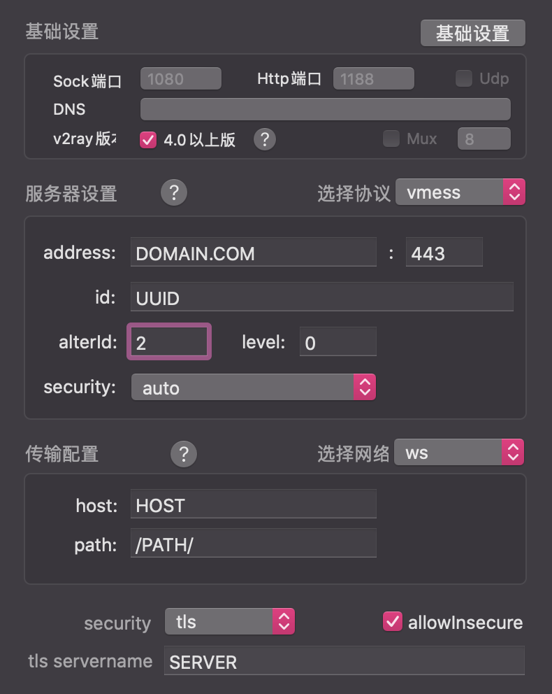
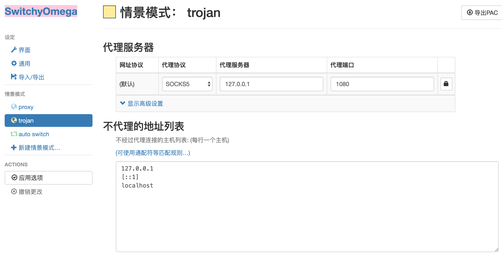
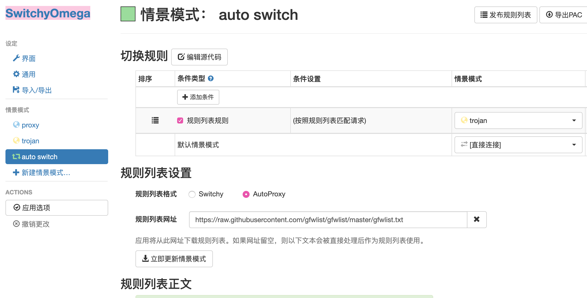

# VPS搭梯之 trojan + v2ray

其中 v2ray采用websocket + tls + caddy

### 要求：
- VPS（以下搭建环境为GCP上的Debain系统）
- 域名并绑定A记录DNS解析

已将需要到脚本都上传到了本repo，若有需要可以更改为此下载链接

## VPS端安装

1. 端口管理

  - 安装ufw：
  
    `sudo apt-get install ufw`
    
  - 设置允许ssh（22）端口：
  
    `sudo ufw allow ssh`
    
  - 查看状态：
  
    `sudo ufw status`
  
  - 开启ufw：
  
    `sudo ufw enable`
  
  - `sudo ufw allow 80`
  
    `sudo ufw allow 443`
    

2. 安装与配置caddy

  - `wget -N --no-check-certificate https://raw.githubusercontent.com/ToyoDAdoubi/doubi/master/caddy_install.sh && chmod +x caddy_install.sh && sudo bash caddy_install.sh install`
     
     - 备份: `wget -N --no-check-certificate https://raw.githubusercontent.com/dreamcontinue/ladder4GFW/master/Ladder4GFW/server/caddy_install.sh && chmod +x caddy_install.sh && sudo bash caddy_install.sh` 

  - 配置Caddyfile：
  
     - `sudo touch /usr/local/caddy/Caddyfile`
     
	 - `sudo vim /usr/local/caddy/Caddyfile`
	 
	 - 写入以下配置
         ``` json
         DOMAIN.COM {  // 改域名
             tls EXAMPLE@DOMAIN.COM  // 改
             log /var/log/caddy.log
         }
         ```
  - 启动caddy，自动生成证书（`ls / -a` 若存在 `.caddy` 文件夹，则证书创建成功！证书路径位于 `/.caddy/acme/acme-v02.api.letsencrypt.org/sites/DOMAIN.COM/DOMAIN.COM.crt`,申请证书一周内有限制，勿多试！）：
  
    `sudo service caddy start`
    
  - 由于caddy申请的证书只有3个月有效期，到期后需先关闭caddy和trojan后再执行该步骤，修改下Caddyfile文件获取新证书

3. 安装与配置trojan、Caddyfile

  - 安装curl：
  
    `apt-get install -y curl`
    
  - 安装trojan：
  
    `wget -N --no-check-certificate https://raw.githubusercontent.com/trojan-gfw/trojan-quickstart/master/trojan-quickstart.sh && chmod +x trojan-quickstart.sh && sudo bash trojan-quickstart.sh`
    
    - 备份: `wget -N --no-check-certificate https://raw.githubusercontent.com/dreamcontinue/ladder4GFW/master/Ladder4GFW/server/trojan_install.sh && chmod +x trojan_install.sh && sudo bash trojan_install.sh` 
  
  - 关闭caddy：
  
    `sudo service caddy stop`
  
  - 修改Caddyfile：
  
	 - `sudo vim /usr/local/caddy/Caddyfile`
	 
	 - 写入以下配置
         ```json
        :80 {
            root PATH/TO/SITE   // 改 样例 /var/www/site
            gzip
            browse
        }
         ```
       
  - 启动caddy：
  
    `sudo service caddy start`

  - 修改trojan配置
  
    `sudo vim /usr/local/etc/trojan/config.json`
  
  - 修改password与证书及密钥文件位置参数
    - 修改 `password1`，`password2`
	- 修改 `"cert": "/.caddy/acme/acme-v02.api.letsencrypt.org/sites/DOMAIN.COM/DOMAIN.COM.crt"`
	- 修改 `"key": "/.caddy/acme/acme-v02.api.letsencrypt.org/sites/DOMAIN.COM/DOMAIN.COM.key"`

4. 运行trojan

  - `sudo systemctl start trojan`
  
  - 查看状态 
  
    `sudo systemctl status trojan`
  
  - 加入自启动 
  
    `sudo systemctl enable trojan caddy`
  
  至此trojan安装完成，以下安装v2ray（如不需要可直接到此结束）
  
5. 安装与配置v2ray、Caddyfile

  - 安装v2ray 
  
    `wget -N --no-check-certificate https://install.direct/go.sh && chmod +x go.sh && sudo bash go.sh`
    
    - 备份: `wget -N --no-check-certificate https://raw.githubusercontent.com/dreamcontinue/ladder4GFW/master/Ladder4GFW/server/v2ray_install.sh && chmod +x v2ray_install.sh && sudo bash v2ray_install.sh` 

  - 查看v2ray的配置文件
    
    `sudo vim /etc/v2ray/config.json`
  
    - 记住其中 `port`（记YOUR_PORT），`path`（记/PATH/）参数(或直接修改为以下配置 [config.json](server/config.json)，大写需改)
         ```json
        {
          "log": {
                "access": "/var/log/v2ray/access.log",
                "error": "/var/log/v2ray/error.log",
                "loglevel": "warning"
            },
          "inbounds": [{  // 输入流量
            "port": YOUR_PORT,  // 改端口
              "listen": "127.0.0.1", 
              "tag": "vmess-in", 
              "protocol": "vmess", 
              "settings": {
                "clients": [{
                  "id":"UUIDUUID-UUID-UUID-UUID-UUIDUUIDUUID",  // 改UUID
                  "alterId": 64  // 可改可不改
                  }]
              }, 
              "streamSettings": {
                "network": "ws", 
                "wsSettings": {
                  "path":"/PATH/"  // 改路径
                }
              }
            }], 
          "outbounds": [{  // 输出流量
              "protocol": "freedom", 
              "settings": { }, 
              "tag": "direct"
            },{ 
              "protocol": "blackhole", 
              "settings": { }, 
              "tag": "blocked"
            }],
          "dns": {
            "servers": [
              "https+local://1.1.1.1/dns-query",
              "1.1.1.1",
              "1.0.0.1",
              "8.8.8.8",
              "8.8.4.4",
              "localhost"
            ]
          },
          "routing": {
            "domainStrategy": "AsIs", 
            "rules": [{
                "type": "field", 
                "inboundTag": [  // 输入流量重定向到输出的直连流量
                  "vmess-in"
                ], 
                "outboundTag": "direct"
              }]
          }
        }
         ```

  - 关闭caddy：
  
    `sudo service caddy stop`
  
  - 修改Caddyfile配置：
  
    `sudo vim /usr/local/caddy/Caddyfile`
     
    ```json
    :80 {
        root PATH/TO/SITE  // 改
        gzip
        browse
        proxy /PATH/ localhost:YOUR_PORT {  // 改两个
            websocket
            header_upstream -Origin
        }
    }
    ```
  - 启动caddy：
  
    `sudo service caddy start`
  
  - 启动v2ray：
  
    `sudo service v2ray start`
  
  - v2ray自启动 
  
    `sudo systemctl enable v2ray`


## 客户端配置

mac os 

[V2rayU](https://github.com/yanue/V2rayU) 配置如下（可以直接复制vmess://xxxxx）



[trojan](https://github.com/trojan-gfw/trojan) 配置方法
- 修改文件夹下的 `config.json` 文件，其中 `remote_addr` 改为 `DOMAIN.COM` ，更改 `password`
- 运行文件夹下的 `start.command`
- chrome下安装扩展程序 `SwitchyOmega`，配置如下
  - 
  - 
    `https://raw.githubusercontent.com/gfwlist/gfwlist/master/gfwlist.txt`
  - 使用auto switch模式

ios 

[shadowrocket](https://apps.apple.com/us/app/shadowrocket/id932747118) 需用美区账号
- V2ray可以直接复制vmess://xxxxx后在app打开即可自动配置
- trojan配置一目了然


## 配置国内中转服务器

若有需要可配置国内中转服务器（以下搭建环境为阿里云上的Debain系统）

客户端v2ray ----> 中转v2ray ----> 国外v2ray

1. 安装v2ray，同上。（若无法下载，手动下载v2ray并更改脚本 `LOCAL_INSTALL = '1'`, `LOCAL = 'PATH/TO/V2RAY'`即可）

2. 更改配置，其配置样例参考 [config.json](transit/config.json)，大部分可以直接从客户端的配置直接复制

3. 启动v2ray：

  - `sudo service v2ray start`
    
  - `sudo systemctl enable v2ray`