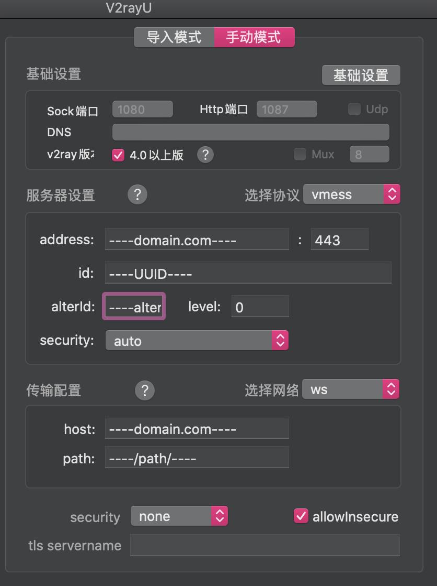
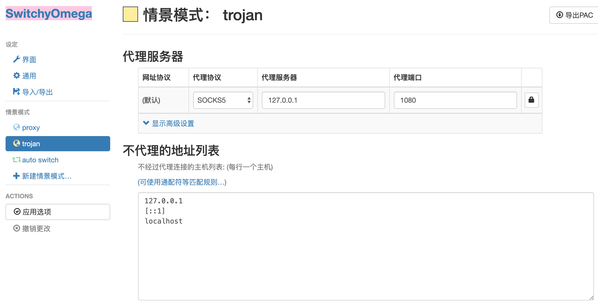
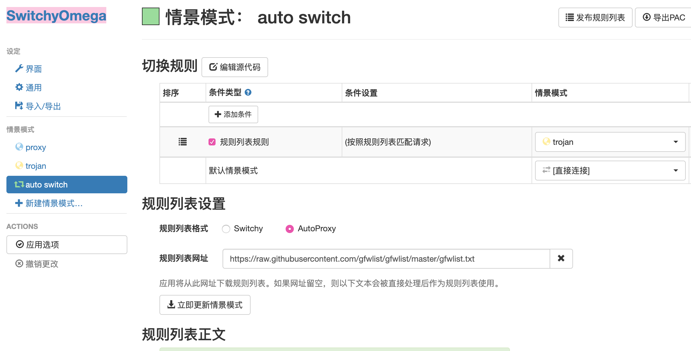

# VPS搭梯之 trojan + v2ray

## 要求：
- VPS（以下搭建环境为GCP上的Debain9）
- 域名并绑定A记录DNS解析

已将需要到脚本都上传到了本repo，若有需要可以更改为此下载链接

## VPS端安装步骤

1. 安装ufw并开启80、443端口
  - 安装ufw：`sudo apt-get install ufw`
  - 设置允许ssh（22）端口：`sudo ufw allow ssh`
  - 查看状态：`sudo ufw status`
  - 开启ufw：`sudo ufw enable`
  - `sudo ufw allow 80`
  - `sudo ufw allow 443`

2. 安装caddy
  - `wget -N --no-check-certificate https://raw.githubusercontent.com/ToyoDAdoubi/doubi/master/caddy_install.sh && chmod +x caddy_install.sh && sudo bash caddy_install.sh install`
  - 配置Caddyfile：
     - `sudo touch /usr/local/caddy/Caddyfile`
	 - `sudo vim /usr/local/caddy/Caddyfile`
	 - 写入以下配置
	 ``` json
	 ----domain.com---- {
	     tls ----name@domain.com----
		 log /var/log/caddy.log
   	 }
     ```
  - 启动caddy：`sudo service caddy start`
  - `tail -f /tmp/caddy.log` 若出现日志文件出现 `Serving HTTPS on port 443  https://xxxxx.xxx`，即表示证书创建成功
  - 由于caddy申请的证书只有3个月有效期，到期后需先关闭caddy和trojan后再执行该步骤，修改下Caddyfile文件获取新证书（改用nginx可解决？）

3. 安装trojan 配置Caddyfile
  - 安装curl：`apt-get install -y curl`
  - 安装trojan：`wget -N --no-check-certificate https://raw.githubusercontent.com/trojan-gfw/trojan-quickstart/master/trojan-quickstart.sh && chmod +x trojan-quickstart.sh && sudo bash trojan-quickstart.sh`
  - 关闭caddy：`sudo service caddy stop`
  - 修改Caddyfile：
	 - `sudo vim /usr/local/caddy/Caddyfile`
	 - 写入以下配置
	 ```json
	:80 {
	    root ----/path/to/yoursite----
		gzip
		browse
	}
     ```
  - 启动caddy：`sudo service caddy start`

4. 修改trojan配置
  - `sudo vim /usr/local/etc/trojan/config.json`
  - 修改password与证书及密钥文件位置参数
    - 修改 `password1`，`password2`
	- 修改 `"cert": "/.caddy/acme/acme-v02.api.letsencrypt.org/sites/----domain.com----/----domain.com----.crt"`
	- 修改 `"key": "/.caddy/acme/acme-v02.api.letsencrypt.org/sites/----domain.com----/----domain.com----.key"`

5. 运行trojan
  - `sudo systemctl start trojan`
  - 查看状态 `sudo systemctl status trojan`
  - 加入自启动 `sudo systemctl enable trojan` `sudo systemctl enable caddy`
  - 错误日志 `journalctl -fu trojan`

  至此trojan安装完成，以下安装v2ray（如不需要可直接到此结束）
  
6. 安装v2ray
  - `wget -N --no-check-certificate https://install.direct/go.sh && chmod +x go.sh && sudo bash go.sh`
7. 查看v2ray的ws配置文件：
  - `sudo vim /etc/v2ray/config.json`
    - 记住其中 `port`（记----your_port----），`path`（记----/path/----）参数
    - 或修改为以下配置（从本人以前的配置中导出的）
	 ```json
    {
      "log": {
            "access": "/var/log/v2ray/access.log",
            "error": "/var/log/v2ray/error.log",
            "loglevel": "warning"
        },
      "inbounds": [
        {
        "port":----your_port----,
          "listen": "127.0.0.1", 
          "tag": "vmess-in", 
          "protocol": "vmess", 
          "settings": {
            "clients": [
              {
          "id":"----UUID----",
          "alterId":----alterId----
              }
            ]
          }, 
          "streamSettings": {
            "network": "ws", 
            "wsSettings": {
          "path":"----/path/----"
            }
          }
        }
      ], 
      "outbounds": [
        {
          "protocol": "freedom", 
          "settings": { }, 
          "tag": "direct"
        }, 
        {
          "protocol": "blackhole", 
          "settings": { }, 
          "tag": "blocked"
        }
      ], 
      "dns": {
        "servers": [
          "https+local://1.1.1.1/dns-query",
        "1.1.1.1",
        "1.0.0.1",
        "8.8.8.8",
        "8.8.4.4",
        "localhost"
        ]
      },
      "routing": {
        "domainStrategy": "AsIs", 
        "rules": [
          {
            "type": "field", 
            "inboundTag": [
              "vmess-in"
            ], 
            "outboundTag": "direct"
          }
        ]
      }
    }
     ```

8. 修改Caddyfile：
  - 关闭caddy：`sudo service caddy stop`
  - `sudo vim /usr/local/caddy/Caddyfile`
  - 修改为以下配置：
	 ```json
	:80 {
	    root ----/path/to/yoursite----
		gzip
		browse
		proxy ----/path/---- localhost:----your_port---- {
		    websocket
		    header_upstream -Origin
		}
	}
    ```
  - 启动caddy：`sudo service caddy start`
  - 启动v2ray：`sudo service v2ray start`
  - v2ray自启动 `sudo systemctl enable trojan`


## 客户端下载
macos 

[V2rayU](https://github.com/yanue/V2rayU) 配置如下（可以直接复制vmess://xxxxx）



[trojan](https://github.com/trojan-gfw/trojan) 配置方法
- 修改文件夹下的`config.json`文件，其中`remote_addr`改为`----domain.com----`，更改`password`
- 运行文件夹下的`start.command`
- chrome下安装扩展程序`SwitchyOmega`，配置如下
  - 
  - 
    `https://raw.githubusercontent.com/gfwlist/gfwlist/master/gfwlist.txt`
  - 使用auto switch模式

ios 

[shadowrocket](https://apps.apple.com/us/app/shadowrocket/id932747118) 需用美区账号
- V2ray可以直接复制vmess://xxxxx后在app打开即可自动配置
- trojan配置一目了然